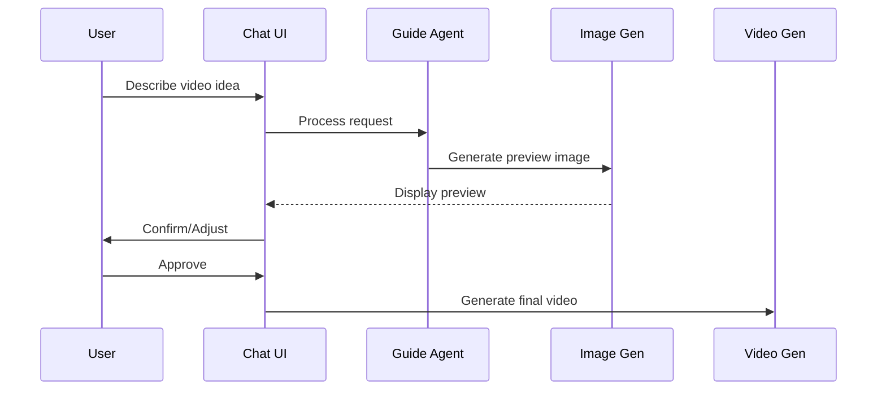
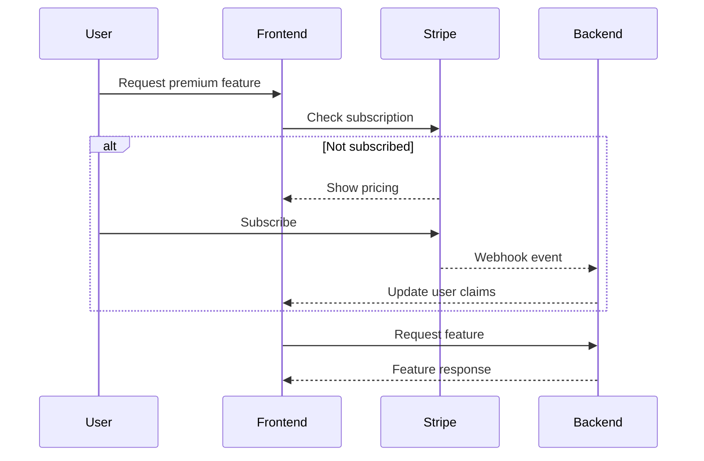
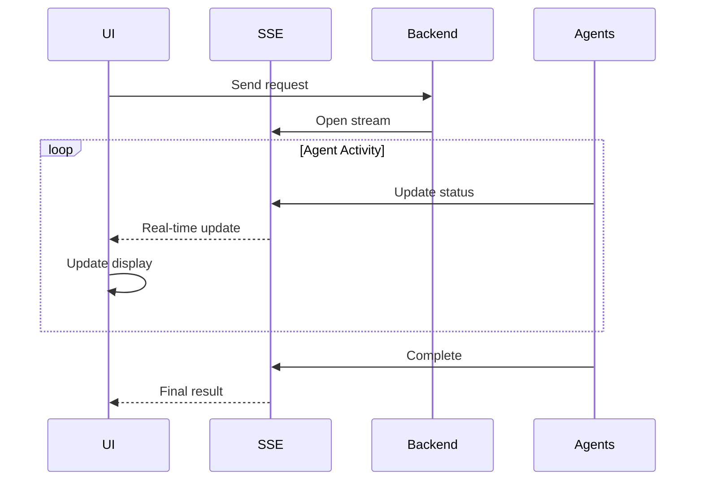

📄 Product Requirements Document (PRD)

Project Name: 82ndrop
Owner: Abdullah Abrahams
Team: Taajirah
Status: In Development
Last Updated: [Insert today’s date]

⸻

1. 🎯 Objective

82ndrop is an AI-powered platform that helps users generate vertical short-form video content prompts using a natural chat interface and multi-agent AI system. The system is designed for creators who want to move from idea to video without traditional editing tools.

⸻

2. 📌 Goals (v1.0)
   • Provide intelligent, structured video prompt generation via chat
   • Ensure image generation happens before video generation
   • Maintain a mobile-first, smooth UX
   • Show real-time agent activity in the UI (following Google ADK guidance)
   • Integrate Stripe billing to unlock premium features (image & video gen)
   • Retain free chat-based experience, with optional usage limits
   • Maintain shared Firebase project for staging + production
   • Leverage existing GitHub Actions + Cloud Run deployments

⸻

3. 👤 User Stories

As a content creator:
• I want to describe my idea and receive a ready-to-use video concept
• I want to generate an image first to visualize my idea
• I want the system to only trigger relevant AI agents, not all at once
• I want to see when an agent is working and what it’s doing
• I want to use the basic chat for free and pay only for advanced outputs
• I want to use it easily on my phone without layout issues

⸻

4. 🧠 Core Features
   • Multi-Agent AI Workflow (Guide, TaskMaster, Image, Video, etc.)
   • Conversational Chat UI with memory and session history
   • Stripe Billing Integration to gate image and video generation
   • Real-time Agent Activity Display using Google ADK signals
   • Master Prompt Templates with Top/Center/Bottom structure
   • Vertical-first UX optimized for TikTok, Reels, Shorts
   • Responsive UI with full mobile support

⸻

5. 🖥️ Technical Stack

Layer Tech
Frontend Angular 19 + Firebase Hosting
Backend FastAPI + Google ADK
Auth Firebase Auth
Payments Stripe
Storage Firebase Storage
Deployment Google Cloud Run + GitHub Actions

⸻

6. 🚨 Known Issues
   • Mobile input field is often not visible or usable
   • All agents are being triggered regardless of context
   • No UI reflection of which agent is currently active
   • Stripe not yet integrated

⸻

7. ✅ Next Steps
   1. Fix mobile input visibility
   2. Add image generation step before video
   3. Refactor agent routing logic (intent-based triggering)
   4. Implement real-time agent activity display
   5. Integrate Stripe billing with usage-based gating
   6. Push full flow to production (same Firebase project)

sequenceDiagram
participant User
participant Chat UI
participant Guide Agent
participant Image Gen
participant Video Gen

    User->>Chat UI: Describe video idea
    Chat UI->>Guide Agent: Process request
    Guide Agent->>Image Gen: Generate preview image
    Image Gen-->>Chat UI: Display preview
    Chat UI->>User: Confirm/Adjust
    User->>Chat UI: Approve
    Chat UI->>Video Gen: Generate final video

    sequenceDiagram
    participant User
    participant Frontend
    participant Stripe
    participant Backend

    User->>Frontend: Request premium feature
    Frontend->>Stripe: Check subscription
    alt Not subscribed
        Stripe-->>Frontend: Show pricing
        User->>Stripe: Subscribe
        Stripe-->>Backend: Webhook event
        Backend-->>Frontend: Update user claims
    end
    Frontend->>Backend: Request feature
    Backend-->>Frontend: Feature response

    sequenceDiagram
    participant User
    participant Frontend
    participant Stripe
    participant Backend

    User->>Frontend: Request premium feature
    Frontend->>Stripe: Check subscription
    alt Not subscribed
        Stripe-->>Frontend: Show pricing
        User->>Stripe: Subscribe
        Stripe-->>Backend: Webhook event
        Backend-->>Frontend: Update user claims
    end
    Frontend->>Backend: Request feature
    Backend-->>Frontend: Feature response

### 1. Current Implementation Status

**Strengths:**

1. **Multi-Agent Architecture**

   - Well-structured multi-agent system using Google ADK
   - Clear separation of concerns between agents:
     - Guide Agent: Analyzes and structures video ideas
     - Search Agent: Enhances with trends and viral content
     - Prompt Writer: Generates final natural language prompts
   - Robust callback system for monitoring and logging

2. **Vertical Video Focus**

   - Already optimized for 9:16 aspect ratio (TikTok, Reels, Shorts)
   - Master Prompt Template with Top/Center/Bottom structure
   - Mobile-first UX considerations

3. **Session Management**

   - Firebase integration for session persistence
   - Real-time sync between ADK backend and Firebase
   - Session history browsing capability

4. **Authentication & Authorization**
   - Firebase Authentication implemented
   - Role-based access control with custom claims
   - Specific authorization for video generation features

### 2. Gaps vs PRD Requirements

1. **Image Generation Pipeline** ❌

   - PRD requires image generation before video
   - Current implementation jumps directly to video generation
   - No intermediate image visualization step

2. **Stripe Integration** ❌

   - No current implementation of Stripe billing
   - Missing usage-based gating for premium features
   - No distinction between free and premium features

3. **Agent Activity Display** ⚠️

   - Basic workflow steps display exists
   - But needs enhancement to show real-time agent activity
   - Current UI doesn't fully reflect which agent is active

4. **Intent-based Agent Triggering** ⚠️
   - Current system triggers all agents sequentially
   - PRD requires context-aware agent triggering
   - Need to refactor agent routing logic

### 3. Implementation Recommendations

Let me create a structured task list to track the implementation plan:
Ran tool
Let me detail the implementation approach for each major component:

1. **Image Generation Pipeline**

2. **Stripe Integration**

3. **Agent Activity Display**

### 4. Technical Recommendations

1. **Image Generation Integration**

   - Integrate with Firebase AI's client-side Imagen model
   - Add image preview component in chat UI
   - Store generated images in Firebase Storage
   - Add image approval/rejection flow

2. **Stripe Implementation**

   - Use Stripe Elements for payment UI
   - Implement usage tracking in Firebase
   - Create webhook handler for subscription events
   - Update Firebase custom claims based on subscription

3. **Agent Activity Enhancement**

   - Leverage existing SSE implementation
   - Add detailed agent state tracking
   - Enhance UI progress indicators
   - Add agent-specific loading states

4. **Intent-based Routing**
   - Add intent classification to Guide Agent
   - Create routing rules based on intent
   - Implement selective agent activation
   - Add fallback handling

### 5. Next Steps

1. **Immediate Actions**

   - Fix mobile input visibility issue (high priority)
   - Implement image generation step - **DONE**
   - Enhance real-time agent activity display
   - Refactor agent routing logic
   - Begin Stripe integration for premium features

2. **Short-term Goals**

   - Refactor agent routing logic
   - Enhance real-time agent activity display
   - Configure shared Firebase staging/prod environment

3. **Long-term Considerations**
   - Scale usage monitoring
   - Optimize image/video generation costs
   - Enhance session persistence
   - Implement analytics tracking
