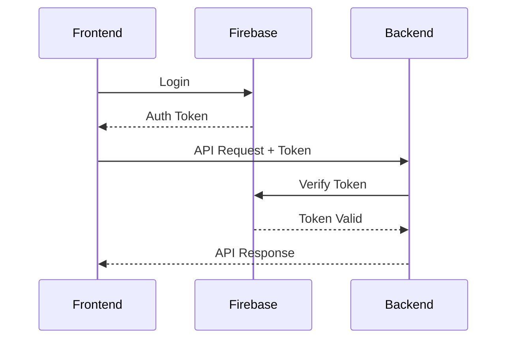
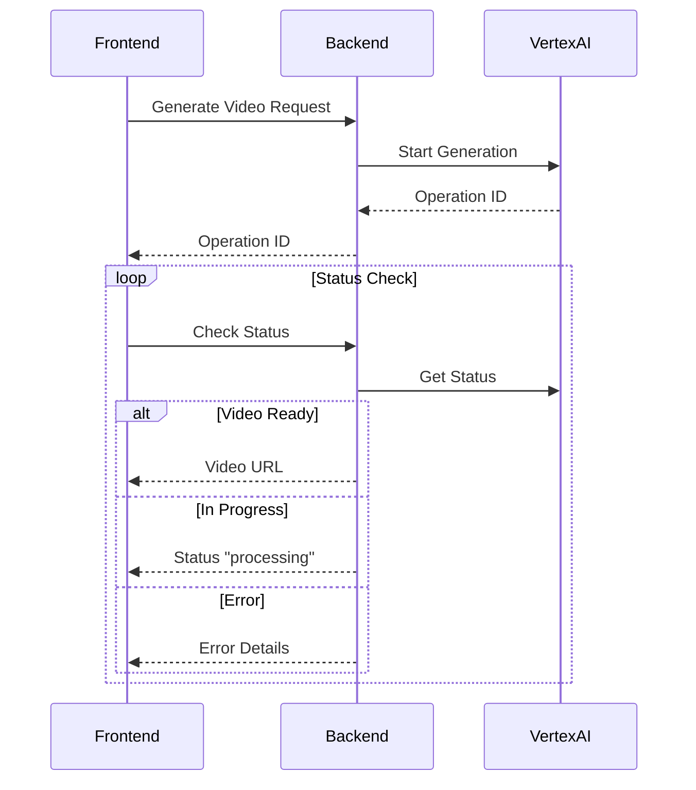

## Session Bridge Implementation

### Architecture Overview

The session bridge connects the Angular frontend with the FastAPI backend, handling:

- Authentication state
- Video generation requests
- Status polling
- Error handling

### Components

1. Frontend (Angular)

```typescript
// Service for managing API communication
@Injectable({
  providedIn: "root",
})
export class AgentService {
  private baseUrl = environment.apiUrl;

  constructor(private http: HttpClient) {}

  // Add auth token to all requests
  private getHeaders(): HttpHeaders {
    return new HttpHeaders().set(
      "Authorization",
      `Bearer ${this.getFirebaseToken()}`
    );
  }

  // Video status endpoint
  getVideoStatus(operationId: string): Observable<VideoStatus> {
    return this.http.get<VideoStatus>(
      `${this.baseUrl}/video-status/${operationId}`,
      { headers: this.getHeaders() }
    );
  }
}
```

2. Backend (FastAPI)

```python
# Authentication middleware
async def verify_token(request: Request):
    token = request.headers.get('Authorization')
    if not token or not token.startswith('Bearer '):
        raise HTTPException(status_code=401)

    try:
        # Verify Firebase token with correct audience
        decoded_token = auth.verify_id_token(token)
        if decoded_token['aud'] != 'taajirah':
            raise ValueError('Invalid audience')
        return decoded_token
    except Exception as e:
        raise HTTPException(status_code=401, detail=str(e))
```

### Communication Flow

1. Authentication Flow



2. Video Generation Flow



### Error Handling

1. Authentication Errors

- Invalid token format
- Expired tokens
- Wrong audience claim
- Missing authorization header

2. API Errors

- 401 Unauthorized
- 404 Operation Not Found
- 500 Internal Server Error

### Best Practices

1. Frontend

- Implement token refresh
- Handle API errors gracefully
- Implement request retry logic
- Use proper typing for API responses

2. Backend

- Validate all incoming requests
- Proper error messages
- Rate limiting
- Request logging

### Testing

1. Local Development

```bash
# Start backend
uvicorn main:app --reload --port 8000

# Start frontend
ng serve
```

2. Integration Tests

- Authentication flow
- Video generation flow
- Error handling
- Token refresh

### Security Considerations

1. Token Handling

- Secure token storage
- Regular token refresh
- Proper audience validation

2. API Security

- HTTPS only
- Rate limiting
- Input validation
- Error message sanitization
