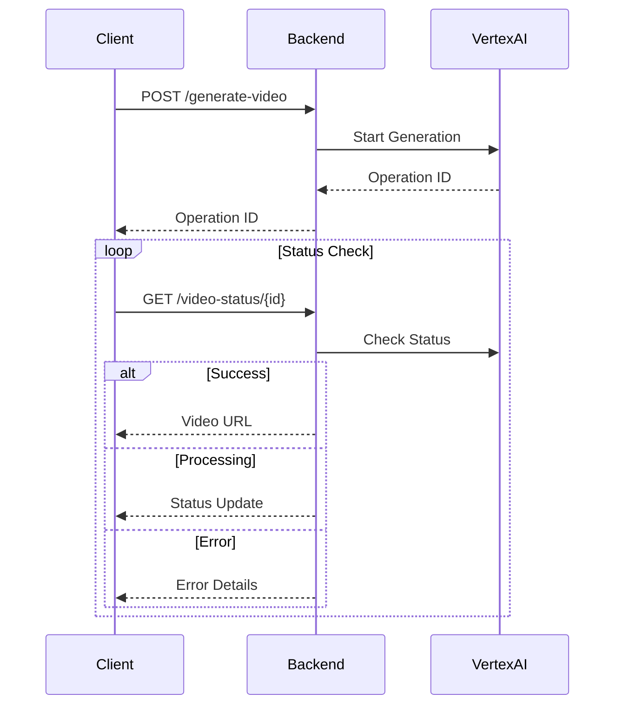

# Video Generation Setup

### Video Format Requirements

1. TikTok-Native Format

```
- Aspect Ratio: 9:16 (vertical)
- Duration: 8-30 seconds
- Resolution: 1080x1920 recommended
- Frame Rate: 30fps
```

2. Visual Layer Structure

```
Top Third:
- Static text overlay
- Bold, white sans-serif font
- Black outline for readability

Center:
- Main video content
- Bright, slightly oversaturated colors
- Mobile-optimized framing

Bottom Third:
- Dynamic captions
- Branding elements
- Motion B-roll elements
```

### System Requirements

1. Local Development

```bash
# Required Software
- Python 3.12+
- gcloud CLI tool
- Firebase CLI
- ffmpeg for video processing

# Environment Setup
export GOOGLE_APPLICATION_CREDENTIALS="path/to/service-account.json"
export VIDEO_BUCKET="82ndrop-videos-staging-taajirah"  # for staging
```

2. Production Requirements

```
- Vertex AI API enabled
- Storage buckets configured
- Service account with necessary permissions
```

### Error Handling

1. Common Errors and Solutions

```python
# gcloud CLI Missing
ERROR: [Errno 2] No such file or directory: 'gcloud'
SOLUTION: Install Google Cloud SDK and ensure 'gcloud' is in PATH

# Authentication Errors
ERROR: Firebase token verification failed
SOLUTION: Check token audience claim (must be "taajirah")

# Vertex AI Errors
ERROR: Get async operation failed
SOLUTION: Verify operation ID format and existence
```

2. Error Recovery Process

```
1. Check system requirements
2. Verify authentication
3. Validate input parameters
4. Monitor operation status
5. Check fallback storage
```

### Video Generation Process

1. Request Format

```json
{
  "prompt": {
    "aspect_ratio": "9:16",
    "duration": "30",
    "layers": {
      "top": {
        "text": "Main Title",
        "style": "bold, white, sans-serif"
      },
      "center": {
        "content": "Main scene description",
        "effects": "bright, oversaturated"
      },
      "bottom": {
        "captions": ["0-3s: Caption 1", "3-7s: Caption 2"],
        "branding": "@handle | #tags"
      }
    }
  }
}
```

2. Generation Pipeline



### Best Practices

1. Video Quality

- Use high-quality source materials
- Maintain consistent branding
- Follow platform guidelines
- Test on mobile devices

2. Performance

- Monitor API quotas
- Implement request caching
- Use appropriate video codecs
- Optimize file sizes

3. Error Prevention

- Validate inputs thoroughly
- Check system dependencies
- Monitor API health
- Implement proper logging

### Testing Instructions

1. Local Testing

```bash
# Start development server
uvicorn main:app --reload --port 8000

# Test video generation
curl -X POST http://localhost:8000/generate-video \
  -H "Authorization: Bearer $TOKEN" \
  -H "Content-Type: application/json" \
  -d @test-prompt.json
```

2. Integration Testing

- Test with various prompt types
- Verify error handling
- Check video quality
- Validate timing accuracy

### Monitoring and Maintenance

1. System Health Checks

- API availability
- Storage capacity
- Error rates
- Generation times

2. Regular Tasks

- Clean test videos
- Update dependencies
- Monitor quotas
- Backup configurations

## Required System Dependencies

### Google Cloud SDK

```bash
# Installation required for video generation
- Google Cloud SDK (gcloud CLI)
- Properly configured gcloud auth
- Vertex AI API enabled
```

### Installation Steps

1. Install Google Cloud SDK:

   ```bash
   # macOS (using brew)
   brew install google-cloud-sdk

   # Debian/Ubuntu
   sudo apt-get install google-cloud-sdk

   # Manual download for other systems
   # Visit: https://cloud.google.com/sdk/docs/install
   ```

2. Initialize and authenticate:

   ```bash
   gcloud init
   gcloud auth application-default login
   ```

3. Set project and enable APIs:
   ```bash
   gcloud config set project taajirah
   gcloud services enable aiplatform.googleapis.com
   ```

### Common Errors and Solutions

1. "No such file or directory: 'gcloud'"

   - **Cause**: Google Cloud SDK not installed or not in PATH
   - **Solution**:
     - Install Google Cloud SDK
     - Add to PATH: export PATH=$PATH:/path/to/google-cloud-sdk/bin
     - Restart your terminal

2. Authentication Errors

   - **Cause**: Not logged in or incorrect project
   - **Solution**: Run `gcloud auth application-default login`

3. API Errors
   - **Cause**: Vertex AI API not enabled
   - **Solution**: Enable via console or `gcloud services enable aiplatform.googleapis.com`
